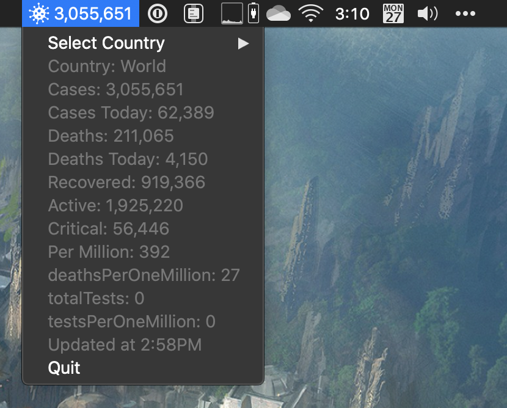

# CoronaBar
   

A simple app that sits in your menu bar, allowing you to see the total number of [COVID-19](https://en.wikipedia.org/wiki/2019%E2%80%9320_coronavirus_pandemic) cases for the World or select country updated every 15 minutes.

This is a fork of the great work done by [duarteocarmo](https://github.com/duarteocarmo/coronabar).

## Install
1. Download the latest version of [CoronaBar.zip](https://github.com/peterwooley/coronabar/releases/latest/download/CoronaBar.zip).
2. Unzip CoronaVirus.app and move it to the  `/Applications` directory.
3. When opening for the first time, right click (or context click) and click Open.
    * If you have problems opening, see [the Support doc on running unsigned apps](https://support.apple.com/en-us/HT202491).

Note: This version was only tested on macOS Catalina 10.15.4.

## Where does the data come from? 

Thanks a lot to [this repo](https://github.com/javieraviles/covidAPI) for providing an API!

Information comes originally from [worldometer](https://www.worldometers.info/coronavirus/). 

## How?
Python 3 and [rumps](https://rumps.readthedocs.io/en/latest/index.html).

❤️🐍

## Why? 

In an attempt to keep myself from opening all of the COVID-19 dashboards every time I thought of it (every 5 to 15 minutes), I figured having a dedicated count in my menu bar would let me peek at how the world is falling apart but then carry on with my day. After two weeks of using this app, I find myself opening the dashboards less.

## Menu Bar Icon
The icon is [virus by Nook Fulloption from the Noun Project](https://thenounproject.com/term/virus/1381300)
